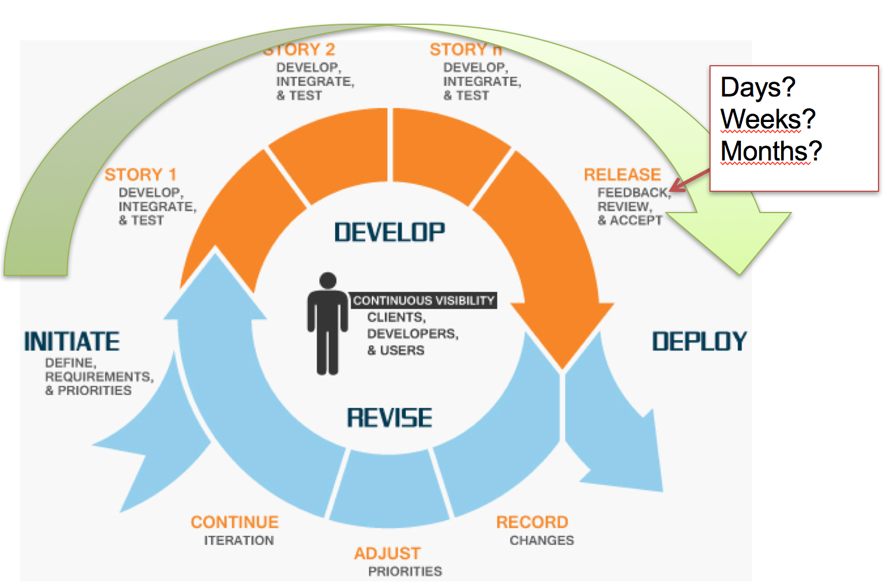
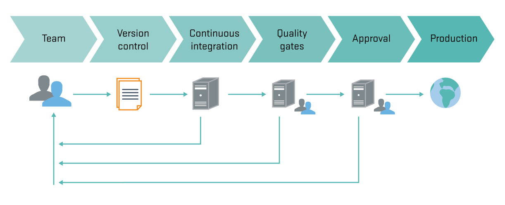
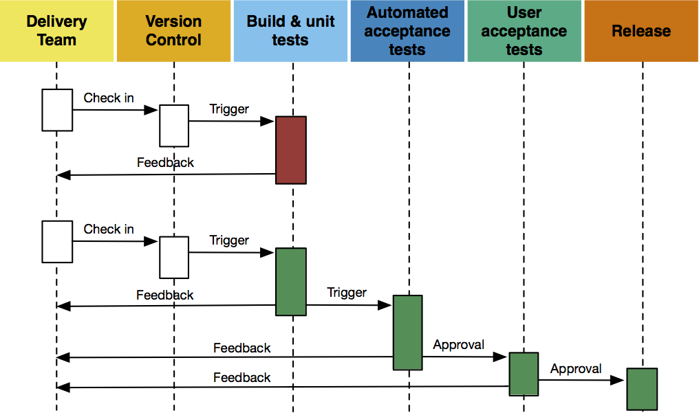
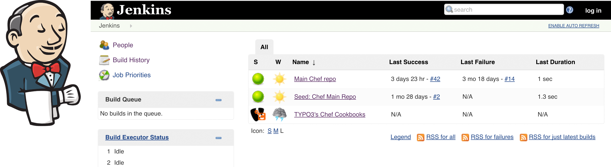
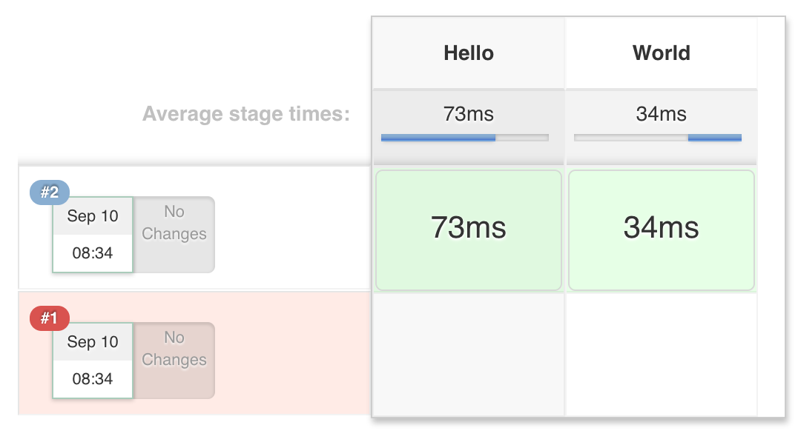
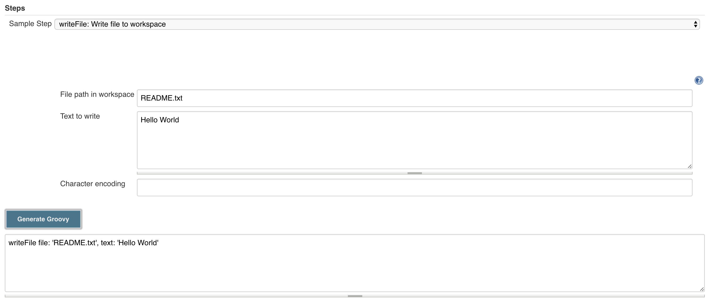
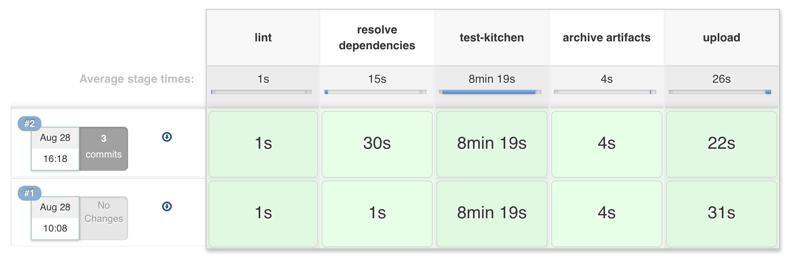
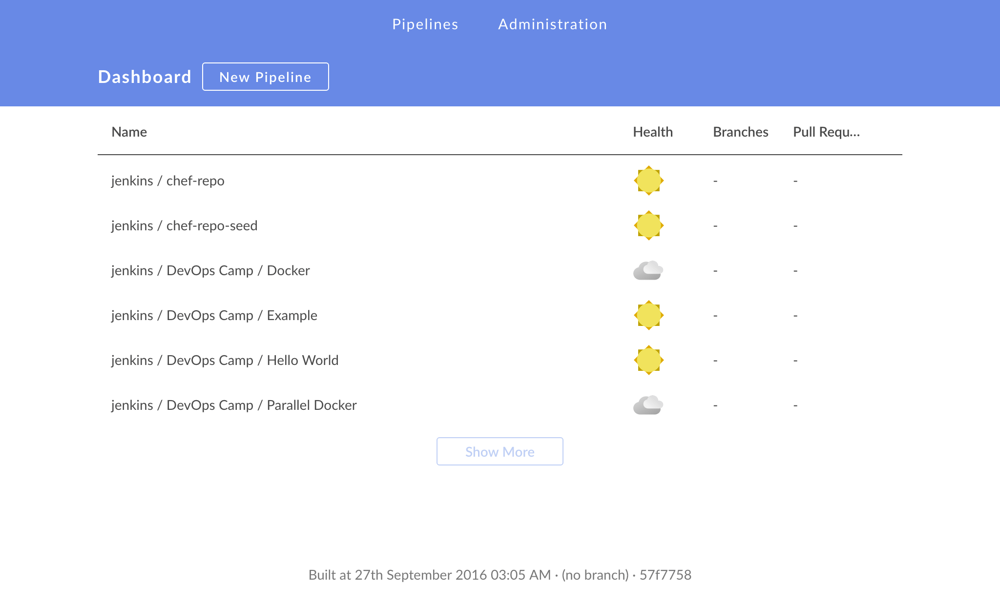
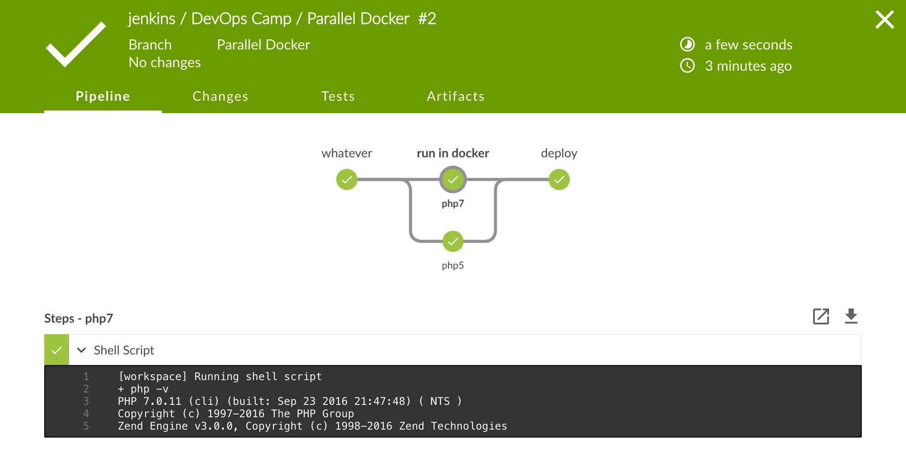
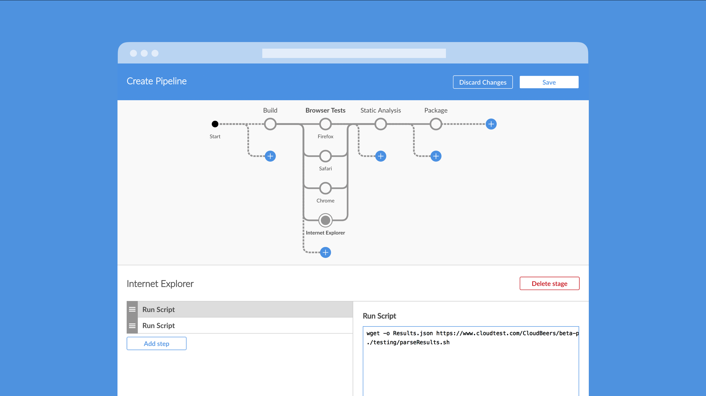

class: center, middle, inverse

# Continuous Delivery

## using Jenkins and the Pipeline Plugins


Steffen Gebert ([@StGebert](https://twitter.com/StGebert))

[DevOps Camp Nürnberg, 2016](http://www.devops-camp.de)

Available at https://github.com/StephenKing/dvocc16-jenkins-pipeline


---
# /me

* Researcher & PhD Student at University of Würzburg (Communication Networks)
* Member of the _TYPO3 Server Admin Team_

---
class: center, middle, inverse
# (Why) Continuous Delivery

---
# Continuous Delivery


- Reduce cycle times
  - Shorter time-to-market
  - Faster feedback

- Plays very well with agile development
  - Agile Manifesto: _"Our highest priority is to satisfy the customer through early and continuous delivery of valuable software."_





---
# Pipelines



- Minimise execution time
- Always aware of latest _stable_ release
- Every checkin triggers pipeline execution

---

# Feedback



- Feedback to the team in every stage
  - Bring the pain forward
  - Fail fast, fail often

---
class: center, middle, inverse
# CI/CD Tools

---
# CI/CD Tools

- On-premise
  - *Jenkins*
  - Thoughtworks Go
  - Gitlab CI
  
- SaaS
  - TravisCI
  - CircleCI
  - AppVeyor
  - Codeship
  - Visual Studio Team Services
   
---
# Why (I like) Jenkins

- Established open source project
- On premise installation
- Thousands of plugins



.footnote[(please excuse the brevity of this list)]

---
# History of CI/CD with Jenkins 

- Downstream Jobs
  - Job A triggers job B triggers job C triggers job D trig...
  - If one job fails, fail all
  
- _Build Pipeline_ View

  


---
class: center, middle, inverse
# But
## that's awkward!

---
# Configuration as Code

- Define jobs/pipelines as code
  - Avoid point & click  
  - **In version control**
  - Lives with the application
  - **Scales better**

- Example: `.travis.yml` (from TravisCI)

```yaml
language: php
services:
  - redis-server
before_script:
  - composer install
script:
  - ./bin/phpunit -c typo3/sysext/core/Build/UnitTests.xml
notifications:
  slack:
    ...
```

---
# Previous Approaches in Jenkins

- Jenkins Job Builder
  - Python / YAML based, from the OpenStack project

- Job DSL plugin
  - Groovy DSL! (e.g. query Github API and create jobs for all branches)
  - Still creates single jobs

```groovy
job('my-project-main') {
    scm {
        git('https://github.com/...')
    }
    triggers {
        scm('H/15 * * * *')
    }
    publishers {
        downstream('my-project-unit')
    }
}
```  

  
---
class: center, middle, inverse

### There is relief
# Jenkins Pipeline Plugins

---
# Jenkins Pipeline Plugins

- Whole suite of plugins (10+)
  - Open-sourced earlier this year
  - Shipped with Jenkins 2.0
  - Formerly commercially available by CloudBees, called _Workflow_
  - Define your pipeline as code (again Groovy DSL)

```groovy
stage("Hello") {
    echo "*Hello*"
}
stage("World") {
    echo "*World*"
}
```



---
# Pipeline Execution

- Jenkins executors (configured, limited number)
  - Heavyweight (run on any _node_ (master, slave), blocks executor)
  - Flyweight (running on master, "for free")

```groovy
node {
    stage("Build") {
        sh "echo Could run 'composer intall' now"
    }
    stage("Unit") {
        sh "echo Could run 'phpunit' now"
    }     // ...
}
```


---
# Pipeline Steps

- Online docs: https://jenkins.io/doc/pipeline/steps/

- Allocate a node
  - `node`: Allocate a node to execute job
  - `node('php')`: Allocates a node (with PHP installed)

- Model pipeline visualisation `stage`
- Get your code: `checkout "https://github.com/.."`

- Execute commands: `sh` (*nix), `bat` (Windows)  

- File Handling: `readFile`, `writeFile`, `fileExists`

- Execute jobs in parallel: `parallel`

- General build step (including parameters): Call any (compatible) plugin
```
step([$class: 'ArtifactArchiver', artifacts: '*.jar'])
```
- Call JobDSL plugin: `jobdsl`

- Plugins contribute additional steps

---

# Confirm Deployment

- Add manual confirmation prior to deployment


```groovy
stage("Signoff") {
    timeout(time: 2, unit: 'HOURS') {
*        input("Deploy that to prod?")
    }
}
stage(name: "Deploy", concurrency: 1) { node {..} }
```

???
node {
    stage("Build") {
        sh "echo Could run 'composer intall' now"
    }
    stage("Unit") {
        sh "echo Could run 'phpunit' now"
    }
}

stage("Signoff") {
    timeout(time: 10, unit: 'SECONDS') {
        input("Deploy that to prod?")
    }
}

stage(name: "Deploy", concurrency: 1) {
    node {
        sh "echo rsync ..."
    }
}


---
# Docker

- Run build jobs within Docker containers
  - No need to install software on Jenkins master/slave
  - Allows to use multiple versions of the same tool

```groovy
stage("run in docker") {
    node {
*       withDockerContainer("php:7-fpm") {
           sh "php -v"
       }
    }
}
```

- Containers can be existing ones ore built on demand
- .. and Kubernetes
 
---
# Snippet Editor & Docs

- Because first steps are hard..

  

- Auto-generated DSL documentation (_Pipeline Syntax_ → _Step Reference_)

---
# Jenkinsfile

- File called `Jenkinsfile` contains pipeline code

- Pipeline code co-located with application code
  - It is versioned
  - Everybody can read (and modify) it

- Throw away your Jenkins installation at any time

- But: Lacks reusability

---
# Multibranch & Org. Folders

- Scans a complete GitHub/Bitbucket organisation for `Jenkinsfile`
  - Triggered by Webhook and/or runs periodically
  - Automatically adds pipeline jobs per repo/branch/PR


---
# Jenkins Global Library

- Provides shared functionality available for all jobs
- Stored on Jenkins master, available to all slaves
	- Available via Jenkins-integrated Git server
	- Can be loaded from remote Git repos, configured in Jenkins and `Jenkinsfile`

- Add your own (Groovy) code

```groovy
package org.foo
class Utilities {
  def steps
  Utilities(steps) {this.steps = steps}
  def mvn(args) {
    steps.sh "${steps.tool 'Maven'}/bin/mvn -o ${args}"
  }
}
```


```groovy
@Library('utils') import org.foo.Utilities
def utils = new Utilities(steps)
node {
  utils.mvn 'clean package'
}
```

---
class: center, middle, inverse
# Real-World Example

---
# Real-World Example


- Chef CI/CD at TYPO3.org: Code that runs the *.typo3.org infrastructure
  - https://chef-ci.typo3.org

- Objective: Chef cookbooks
  - Server provisioning (installs packages, configures services) 
  - Code: https://github.com/TYPO3-cookbooks



---
# Real-World Example (2)

- Scans our GitHub organisation _TYPO3-cookbooks_
  - Automatically adds/removes pipelines for branches and pull requests
  - Triggered via Webhooks
  - Searches for `Jenkinsfile`
```groovy
def pipe = new org.typo3.chefci.v1.Pipeline()
pipe.execute()
```

- Uses Jenkins Global Library
  - Code: [TYPO3-infrastructure/jenkins-pipeline-global-library-chefci](https://github.com/TYPO3-infrastructure/jenkins-pipeline-global-library-chefci)
  

- Only _master_ branch uploads artifact (to Chef Server)
  - (historically using _Git Flow_) 

---

# Parallel Integration Tests

- Run _Test-Kitchen_ (integration test for Chef cookbooks)
- Run all instances in parallel (`kitchen verify <instance>`)

```
$ kitchen status
Instance              Driver   Provisioner  [..] Last Action
default-debian-78     Docker   ChefZero          <Not Created>
default-debian-82     Docker   ChefZero          <Not Created>
physical-debian-78    Docker   ChefZero          <Not Created>
physical-debian-82    Docker   ChefZero          <Not Created>
production-debian-78  Docker   ChefZero          <Not Created>
production-debian-82  Docker   ChefZero          <Not Created>
```
- Extract list of instances from previous output

```groovy
def ArrayList<String> getInstances(){
    def tkInstanceNames = []
    node {
        def lines = sh(script: 'kitchen list', returnStdout: true).split('\n')
        for (int i = 1; i < lines.size(); i++) {
            tkInstanceNames << lines[i].tokenize(' ')[0]
        }
    }
    return tkInstanceNames
}
```
---
class: center, middle, inverse
# Blue Ocean

### The Future of Jenkins UI

---
# Blue Ocean


- Tailored to the pipeline plugins




- https://jenkins.io/projects/blueocean/
- https://jenkins.io/blog/2016/07/19/blue-ocean-update/

---
# Blue Ocean


- Tailored to the pipeline plugins



???

```
stage("whatever") {
    echo "hello"
}

stage("run in docker") {
    parallel(
        php7: {
            node {
                withDockerContainer("php:7-fpm") {
                    sh "php -v"
                }
            }
        },
        php5: {
            node {
                withDockerContainer("php:5") {
                    sh "php -v"
                }
            }
        }
    )
}

stage("deploy") {
    echo "GO!"
}
```

---
# Pipeline Editor




(not yet available)

Source: https://jenkins.io/blog/2016/09/19/blueocean-beta-declarative-pipeline-pipeline-editor/

---

# Declarative Pipelines

- The code that I've shown is probably/maybe [outdated](https://jenkins.io/blog/2016/09/19/blueocean-beta-declarative-pipeline-pipeline-editor/)  (sorry ☺)

```groovy
pipeline {
  agent docker:'node:6.3'
  stages {
    stage('build') {
      sh '..'
    }
    stage ('test') {
      sh 'npm test'
    }
  }

  postBuild {
    always {
      sh 'echo "This will always run"'
    }
    failure {
      sh 'echo "This will run only if failed"'
    }
  }
}
```


---
# Summary

- Continuous Delivery streamlines and speeds up development

- Jenkins pipeline suite modernises its CI/CD capabilities
  - CloudBees, Inc. is very actively pushing development
  - Some parts still pretty tricky
  - Many Jenkins plugins already compatible

- Pipeline defined as code
  - Versioned
  - Doesn't mess up Jenkins jobs
  - Code sharing
  
- Automated pipeline creation based on GitHub/Bitbucket APIs
 
- Blue Ocean refreshes Jenkins' UI

- Still couple of rough edges (failure handling, frequent changes)


---
# Helpful Links

- Tutorial: https://github.com/jenkinsci/pipeline-plugin/blob/master/TUTORIAL.md
- Getting started with pipelines: https://jenkins.io/pipeline/getting-started-pipelines/
- Step documentation: https://jenkins.io/doc/pipeline/steps/
- Pipeline global library: https://github.com/jenkinsci/workflow-cps-global-lib-plugin/blob/master/README.md
- Docker in Jenkins pipelines: https://jenkins.io/blog/2016/08/08/docker-pipeline-environments/
- Notifications (Mail, Slack, etc.): https://jenkins.io/blog/2016/07/18/pipline-notifications/
- Parallel execution: https://jenkins.io/blog/2016/06/16/parallel-test-executor-plugin/
- Pipeline compatibility: https://jenkins.io/blog/2016/05/25/update-plugin-for-pipeline/
- Extending pipeline DSL: https://jenkins.io/blog/2016/04/21/dsl-plugins/
- Jenkins World 2016 Wrap Up - Pipelines: https://jenkins.io/blog/2016/09/24/jenkins-world-2016-wrap-up-pipeline/

- TYPO3's Chef CI: https://chef-ci.typo3.org

